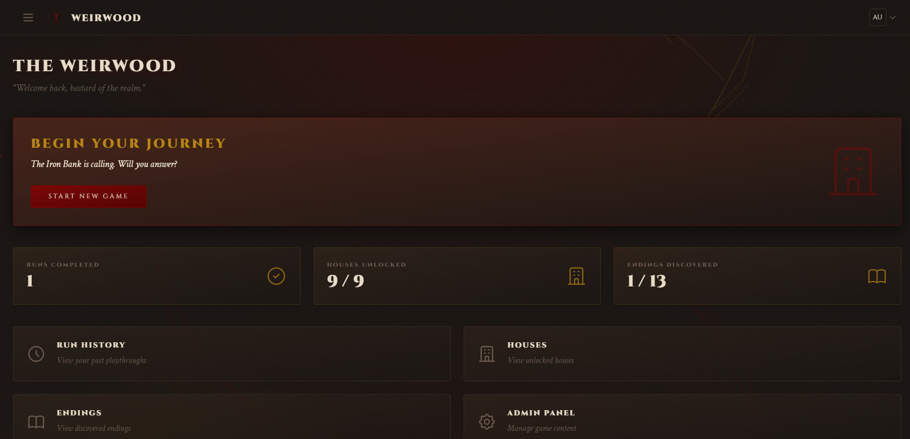
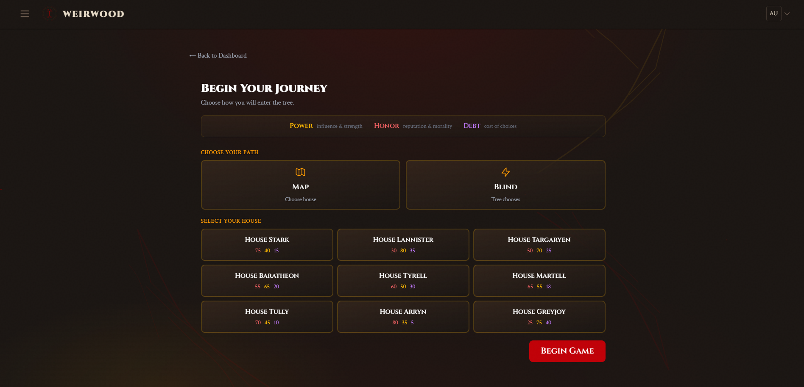
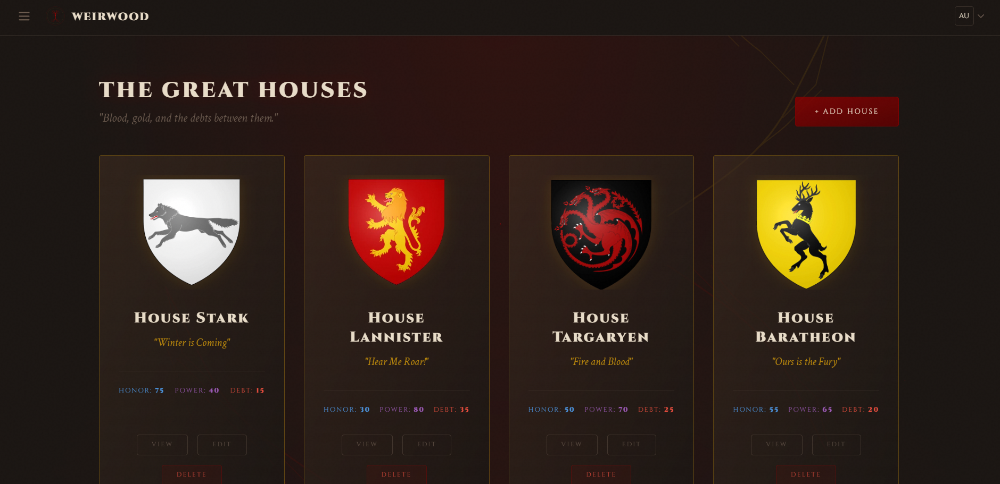
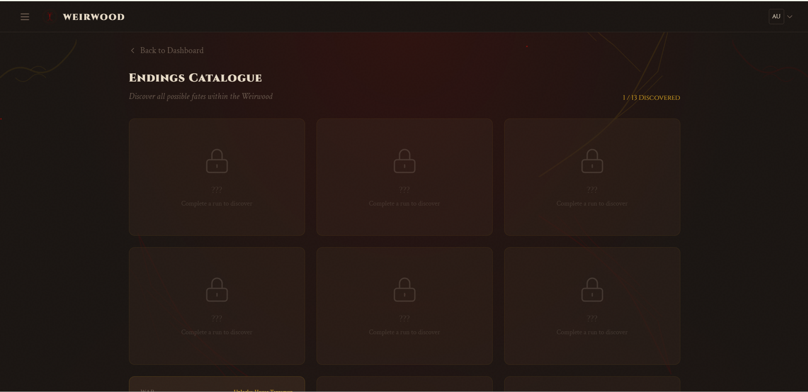

# The Weirwood Decision Simulator


## Application Description and Purpose

**The Weirwood** is a web-based, interactive political drama engine with roguelite progression. Set in a dark, atmospheric fantasy world, players take on the role of the bastard child of a Great House, summoned to the capital to navigate deadly politics. 

The purpose of the application is to simulate a complex, branching narrative where choices have permanent consequences. Every decision directly impacts three core resources: **Honor, Power, and Debt**. As players borrow to survive, they face the ruthless "Iron Bank" mechanic—compounding debt multipliers that can lead to total ruin. Success unlocks new houses, factions, and endings for future playthroughs.

---

## Prerequisites
To run this application locally, you will need the following software installed:

- **PHP 8.0+**: The backend is built with Laravel, which requires PHP 8.0 or higher.
- **Composer**: For managing PHP dependencies.
- **Node.js and npm**: For managing frontend dependencies and compiling assets.
- **PostgreSQL**: The application uses PostgreSQL as its database.

## Installation and Setup Instructions

Follow these steps to set up the project locally:

1. **Clone the repository:**
   ```bash
   git clone https://github.com/yourusername/TheWeirwood.git
   cd TheWeirwood
   ```

2. **Install PHP dependencies:**
   ```bash
   composer install
   ```

3. **Install and compile frontend assets:**
   ```bash
   npm install
   npm run build
   # Or use npm run dev for hot-reloading during development
   ```

4. **Copy the environment file:**
   ```bash
   cp .env.example .env
   ```

5. **Generate the application key:**
   ```bash
   php artisan key:generate
   ```

---

Database setup guide (how to create PostgreSQL database)
6. **Configure the database:**
   Open the `.env` file and update the following lines with your PostgreSQL database credentials:
   ```env
   DB_CONNECTION=pgsql
   DB_HOST=localhost
   DB_PORT=5432
   DB_DATABASE=weirwood
   DB_USERNAME=your_username
   DB_PASSWORD=your_password
    ```

## Migration Commands

Once your database is connected, you need to create the tables and seed the initial game data (Houses, Factions, Nodes, and Choices).


Run the following Artisan command:
```bash
php artisan migrate --seed
```

*Note: The `--seed` flag is critical as it populates the database with the initial story branches and Great Houses required to play the game.*

Finally, start the local development server:
```bash
composer run dev
```
Visit `http://localhost:8000` to begin your journey.

---

## Screenshots

| Dashboard | Begin Journey |
|:---:|:---:|
|  |  |
| *The Player Dashboard* | *Selecting a House and Starting a Run* |

| Hall of Houses | Endings Catalogue |
|:---:|:---:|
|  |  |
| *Reviewing unlocked Great Houses* | *Tracking discovered endings and achievements* |

---

## List of Features Implemented

* **Branching Narrative Engine**: A robust backend that dynamically loads story nodes and available choices based on previous decisions.
* **Resource Management**: Real-time tracking of Honor, Power, and Debt. Honor caps at 100, Debt leads to a Game Over if it reaches 100.
* **The Iron Bank Cascade (Debt Multiplier)**: A punishing mechanic where choices that cost Debt multiply based on the player's current debt threshold (e.g., Critical Debt applies a 1.6x multiplier to costs).
* **House & Faction Gating**: Certain dialogue options and choices are strictly hidden unless the player belongs to the required Great House.
* **Roguelite Progression**: Unlocking one of the 13 distinct endings awards the player access to new Houses for future runs.
* **Thematic UI / UX**: A heavily customized, atmospheric Tailwind CSS layout utilizing custom design tokens (`--blood`, `--ember`, `--gold`, `--coal`) and Alpine.js for immersive transitions and glowing effects.
* **Archivist CMS Ledger**: A detailed background audit log (`debt_events` and `run_states`) recording every choice's mathematical impact for balancing and review.

---

## MVC Architecture Explanation

The application strictly adheres to the **Model-View-Controller (MVC)** architectural pattern, separating the game's logic, database entities, and user interface. 

Here is the project structure and how the architecture is organized:

```text
TheWeirwood/
├── app/
│   ├── Http/
│   │   ├── Controllers/    <-- CONTROLLERS: Handle HTTP requests and orchestrate game logic.
│   │   │   ├── GameController.php   # Processes player choices, calculates multipliers, and advances nodes.
│   │   │   ├── RunController.php    # Manages starting, pausing, or failing a playthrough (run).
│   │   │   └── Auth/                # Handles user authentication and registration.
│   │   └── Middleware/     <-- MIDDLEWARE: Filters requests (e.g., ensuring a player is logged in).
│   │
│   ├── Models/             <-- MODELS: Eloquent ORM classes interacting with PostgreSQL.
│   │   ├── User.php        # Represents the player's account.
│   │   ├── House.php       # The Great Houses (Stark, Lannister, etc.) and their starting stats.
│   │   ├── Game.php        # The active game state linking a User, a Run, and current resources.
│   │   ├── Node.php        # A specific story beat or chapter.
│   │   ├── Choice.php      # The options available at a Node, carrying stat modifiers.
│   │   └── DebtEvent.php   # The audit log recording exactly how much debt was incurred.
│   │
│   └── Services/
│       └── GameEngineService.php  # Extracts heavy math (like Debt Cascades) away from Controllers.
│
├── database/               <-- DATABASE: Migrations and seeders for PostgreSQL.
│   ├── migrations/         # SQL schema definitions (users, houses, nodes, choices).
│   └── seeders/            # Populates the database with initial lore and story paths.
│
├── resources/
│   ├── views/              <-- VIEWS: Blade templates generating the HTML sent to the browser.
│   │   ├── auth/           # Login and Registration screens styled atmospherically.
│   │   ├── components/     # Reusable UI elements (layouts, cards, custom inputs).
│   │   ├── game/           # The main game loop UI displaying nodes and choices.
│   │   └── welcome.blade.php # The landing page hook.
│   │
│   └── css/app.css         # Tailwind CSS variables and imports (--blood, --coal).
│
└── routes/
    └── web.php             <-- ROUTING: Maps URLs (e.g., /game/choose) to Controller methods.
```

### Architecture Details (With Comments)

1. **Models (Data Layer)**
   Models define relationships and encapsulate data constraints. For example, the `Game` model has an active `Run`, and belongs to a `House`. We use Eloquent relationships (like `$node->choices()`) to easily fetch what options a player has at their current stage.
   
2. **Views (Presentation Layer)**
   The views are built using **Laravel Blade** and **Tailwind CSS**. Instead of tightly coupling logic to the UI, the views simply receive variables from the Controller (e.g., `$honor`, `$power`, `$nodeText`) and render them. We use Blade Components (like `<x-layouts.game>`) to ensure the dark fantasy theme is consistently applied across all pages.

3. **Controllers & Services (Logic Layer)**
   Controllers, like `GameController`, catch the user's form submission when they click a choice. 
   - *Example flow*: The user selects "Borrow from the bank."
   - The Controller queries the `Choice` Model.
   - It delegates the math to `GameEngineService`, which checks the Iron Bank rules (applying a 1.3x or 2.0x multiplier depending on current debt).
   - The Controller updates the `Game` Model in the database.
   - Finally, the Controller redirects the user back to the View with the next `Node` loaded.
