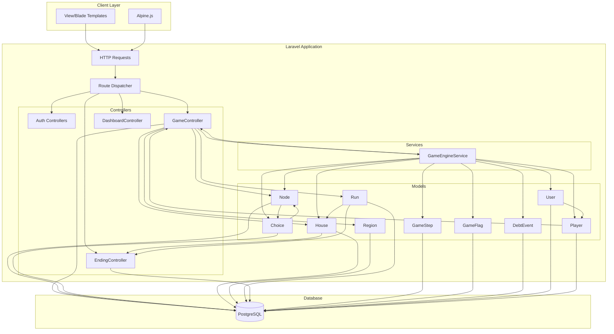
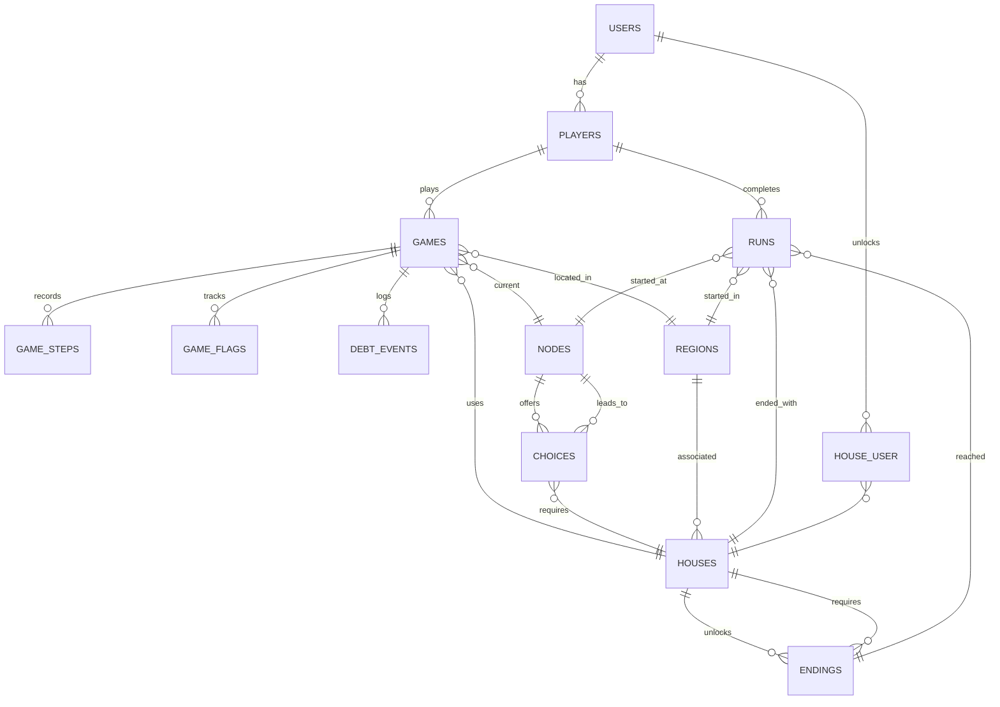
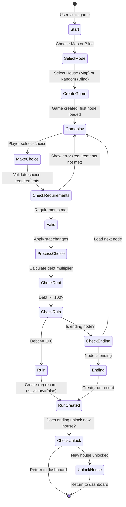
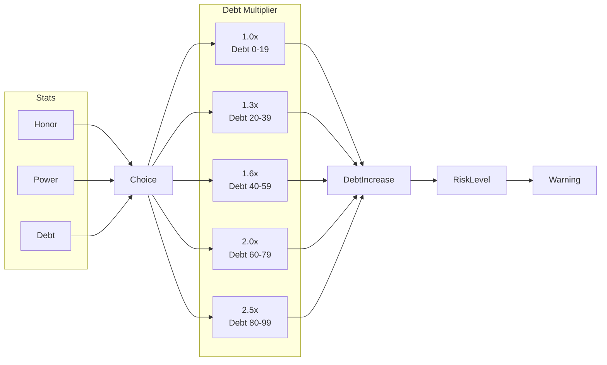

# The Weirwood - Architecture Documentation

## Overview

The Weirwood is a branching narrative game where every choice has a price and every debt compounds. Players navigate through a text-based adventure, making decisions that affect their Honor, Power, and Debt stats.

## System Architecture



## Database Schema



## Game Flow



## Stats System



## Technology Stack

- **Backend**: Laravel 12 (PHP 8.4)
- **Database**: PostgreSQL
- **Frontend**: Blade Templates + Alpine.js
- **Styling**: Tailwind CSS v4
- **Authentication**: Laravel Sanctum
- **Architecture**: MVC with Service Layer

## Key Services

### GameEngineService

Handles all game logic including:

- Processing player choices
- Calculating debt multipliers
- Checking choice requirements
- Managing game flags
- Creating run records

## API/Route Structure

```mermaid
graph LR
    subgraph "Public Routes"
        L[Landing: GET /]
        Login[Login: GET/POST /login]
        Register[Register: GET/POST /register]
    end

    subgraph "Authenticated Routes"
        Dash[Dashboard: GET /dashboard]
        Games[List: GET /games]
        GamesC[Create: GET /games/create]
        GamesS[Start: POST /games/start]
        GamesP[Play: GET /games/{game}/play]
        GamesCh[Choice: POST /games/{game}/choice/{choice}]
        GamesE[End: GET /games/{game}/end]
    end

    subgraph "Archivist Routes (Admin)"
        Houses[CRUD: /houses]
        Nodes[CRUD: /nodes]
        Choices[CRUD: /choices]
        Endings[CRUD: /endings]
    end

    L --> Auth
    Login --> Auth
    Register --> Auth
    Auth --> Dash
    Auth --> Games
    Games --> GamesC
    GamesC --> GamesS
    GamesS --> GamesP
    GamesP --> GamesCh
    GamesP --> GamesE
```

## File Structure

```
app/
├── Http/
│   └── Controllers/
│       ├── Auth/
│       │   ├── LoginController.php
│       │   └── ...
│       ├── GameController.php
│       ├── EndingController.php
│       ├── DashboardController.php
│       └── ...
├── Models/
│   ├── User.php
│   ├── Player.php
│   ├── Game.php
│   ├── Node.php
│   ├── Choice.php
│   ├── House.php
│   ├── Region.php
│   ├── Run.php
│   ├── Ending.php
│   ├── GameStep.php
│   ├── GameFlag.php
│   └── DebtEvent.php
├── Services/
│   └── GameEngineService.php
└── ...

resources/views/
├── games/
│   ├── play.blade.php
│   ├── create.blade.php
│   ├── index.blade.php
│   └── ending.blade.php
├── endings/
│   └── index.blade.php
├── components/
│   └── layouts/
│       ├── game.blade.php
│       └── app.blade.php
└── ...
```
